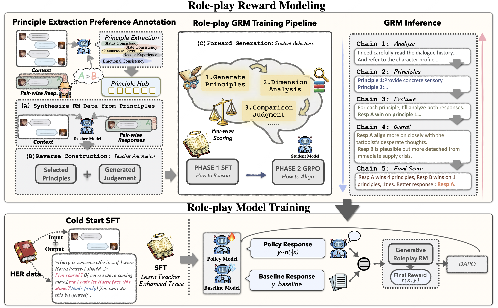

<div align="center">


# 🎭 HER: Hierarchical Emotion Reasoning

### HER: Human-like Reasoning and Reinforcement Learning for LLM Role-playing

<p align="center">
  <a href="https://arxiv.org/abs/2601.21459"></a>
  <a href="https://huggingface.co/datasets/ChengyuDu0123/HER-Dataset"></a>
  <a href="https://huggingface.co/ChengyuDu0123/HER-32B"></a>
  <a href="https://huggingface.co/ChengyuDu0123/HER-RM-32B"></a>
  <a href="https://github.com/cydu24/HER"></a>
</p>


*HER introduces dual-layer thinking that distinguishes characters' first-person thinking from LLMs' third-person thinking for cognitive-level persona simulation.*

</div>

---

## 📖 Overview

LLM role-playing—using LLMs to simulate specific personas—has emerged as a key capability in companionship, content creation, and digital games. While current models effectively capture character tones and knowledge, **simulating the inner thoughts behind their behaviors remains a challenge**.

**HER** (Hierarchical Emotion Reasoning) is a unified framework for cognitive-level persona simulation that introduces:

- 🧠 **Dual-Layer Thinking**: Distinguishes characters' first-person thinking from LLMs' third-person thinking
- 📚 **Reasoning-Augmented Data**: High-quality role-playing data via reverse engineering
- 🎯 **Human-Aligned Rewards**: Principle-based reward models aligned with human preferences

## 🏆 Results


| Rank | Model | CoSER Avg | CoSER SC | CoSER AN | CoSER CF | CoSER SQ | MiniMax Avg | MiniMax Worlds (50%) | MiniMax Stories (25%) | MiniMax Pref (25%) | 95% CI |
|------|-------|-----------|----------|----------|----------|----------|-------------|----------------------|----------------------|--------------------|---------|
| 1 | Claude-4.5-Opus | **62.43** | 63.74 | **64.28** | 58.45 | 63.24 | 76.62 | 67.23 | 82.10 | 89.90 | [75.5, 77.7] |
| 2 | Gemini-3-Pro | 61.80 | **65.95** | 60.42 | **58.34** | 62.49 | 75.60 | 62.72 | 83.87 | 93.08 | [74.5, 76.7] |
| 3 | GPT-5.1 | 61.10 | 64.95 | 53.99 | 60.13 | 65.35 | 80.63 | 76.62 | 72.21 | 97.05 | [79.6, 81.6] |
| 4 | Gemini-2.5-Pro | 60.68 | 61.05 | 60.80 | 57.48 | 63.40 | 68.23 | 52.36 | 82.11 | 86.08 | [67.1, 69.3] |
| 5 | DeepSeek-v3.2 | 58.68 | 55.85 | 57.07 | 57.44 | 64.35 | 60.27 | 45.81 | 66.64 | 82.83 | [59.2, 61.4] |
| 6 | MiniMax-M2-her | 57.30 | 60.03 | 50.11 | 49.30 | **69.77** | **84.65** | **80.55** | 79.97 | **97.51** | [83.6, 85.7] |
| 7 | DeepSeek-v3.1 | 53.50 | 50.15 | 53.18 | 53.93 | 56.72 | 64.22 | 51.11 | 66.45 | 88.21 | [62.9, 65.5] |
| **8** | **HER-RL (this model)** | **53.12** | **54.33** | **47.26** | **52.78** | **58.12** | **65.73** | **59.13** | **57.74** | **86.90** | **[63.0, 68.4]** |
| 9 | HER-SFT | 50.92 | 50.52 | 45.99 | 49.78 | 57.37 | 58.44 | 47.29 | 52.78 | 86.40 | [56.5, 60.4] |
| 10 | Grok-4.1-Fast | 47.40 | 49.21 | 47.57 | 42.64 | 50.17 | 48.47 | 29.87 | 47.51 | 86.64 | [47.4, 49.5] |
| 11 | Claude-4.5-Sonnet | 45.21 | 47.18 | 36.02 | 47.55 | 50.09 | 69.35 | 55.72 | 75.66 | 90.28 | [68.2, 70.5] |
| 12 | Claude-3.7-Think | 39.73 | 44.84 | 31.00 | 42.45 | 40.65 | 61.25 | 50.66 | 59.53 | 84.15 | [58.5, 64.0] |
| 13 | CoSER-70B | 35.95 | 35.05 | 31.16 | 32.28 | 45.33 | 45.38 | 34.32 | 30.32 | 82.58 | [43.5, 47.2] |
| 14 | GPT-5-Mini | 32.97 | 38.10 | 24.60 | 27.20 | 42.00 | 57.63 | 43.32 | 50.11 | 93.78 | [55.9, 59.3] |
| 15 | GPT-4o-240806 | 27.69 | 34.00 | 14.90 | 22.90 | 38.90 | 66.39 | 64.96 | 46.23 | 89.40 | [64.1, 68.7] |
| 16 | GPT-OSS-120B | 26.12 | 32.80 | 14.80 | 21.50 | 35.40 | 60.72 | 47.27 | 56.65 | 91.71 | [58.0, 63.4] |
| 17 | Qwen3-32B | 22.86 | 30.56 | 19.61 | 15.52 | 30.56 | 50.76 | 40.38 | 32.82 | 89.48 | [48.4, 53.2] |

> HER achieves **+30.26%** improvement on CoSER and **+14.97%** on MiniMax Role-Play Bench.


## 🚀 Quick Start

### Installation

```bash
git clone https://github.com/xxx/HER.git
cd HER
pip install -r requirements.txt
```

### Try the Demo

Chat with AI characters from classic literature:

```bash
cd chat_demo

# Interactive chat with 200 classic book scenarios
python chat_demo.py

# Show the model's thinking process
python chat_demo.py --show-think --show-rolethink
```

<details>
<summary>💬 <b>Example Conversation</b></summary>

```
📖 Pride and Prejudice
👥 AI plays: Elizabeth Bennet | You play: Mr. Darcy

════════════════════════════════════════════════════════════════════════════════
🎭 【Elizabeth Bennet's Response】
════════════════════════════════════════════════════════════════════════════════
[His tone is light, but the air feels heavy. I cannot let him see how much
Lady Catherine's intrusion still stings.]
(takes a steadying breath, smoothing the folds of her dress)
I believe I can manage, Father. Though I must admit, I am curious about
what this letter contains.
════════════════════════════════════════════════════════════════════════════════
```

</details>

## 📁 Project Structure

```
HER/
├── 📂 chat_demo/              # 🎮 Interactive demo (try this first!)
│   └── chat_demo.py           # Chat with book characters
│
├── 📂 data_process_code/      # 🔧 Data synthesis pipeline
│   ├── step1_data_process/    # Data cleaning & format conversion
│   ├── step2_gen_rolethinking/# Role thinking enhancement
│   ├── step3_gen_systhinking/ # System thinking generation
│   └── step4_setting_completion/ # Character profile enrichment
│
├── 📂 training_code/          # 🎯 Model training pipeline
│   ├── step1_roleplay_sft/    # Supervised fine-tuning
│   ├── step2_reward_sft/      # Reward model data
│   ├── step3_reward_rl/       # RM training
│   └── step4_roleplay_rl/     # RL training
│
└── 📂 eval_code/              # 📊 Evaluation framework
    ├── benchmarks/coser/      # CoSER multi-turn benchmark
    ├── models/                # Model adapters (vLLM, API)
    └── configs/               # Evaluation configs
```

## 🧠 Dual-Layer Thinking Architecture

HER introduces a hierarchical thinking mechanism:

```
┌─────────────────────────────────────────────────────────────────┐
│                    HER Response Structure                        │
├─────────────────────────────────────────────────────────────────┤
│  ┌─────────────────────────────────────────────────────────┐   │
│  │ 🔍 System Thinking (Third-Person Analysis)              │   │
│  │ "Elizabeth should respond with wit but maintain dignity. │   │
│  │  Consider her pride and her evolving feelings..."       │   │
│  └─────────────────────────────────────────────────────────┘   │
│                              ↓                                   │
│  ┌─────────────────────────────────────────────────────────┐   │
│  │ 💭 Role Thinking (First-Person Inner Thoughts)          │   │
│  │ [His manner is so different now. Can I trust this       │   │
│  │  change, or is it merely another game?]                 │   │
│  └─────────────────────────────────────────────────────────┘   │
│                              ↓                                   │
│  ┌─────────────────────────────────────────────────────────┐   │
│  │ 🎭 Role Response (Speech + Action)                      │   │
│  │ (lifts her chin slightly) "Mr. Darcy, I find your       │   │
│  │ sudden interest in conversation rather remarkable."     │   │
│  └─────────────────────────────────────────────────────────┘   │
└─────────────────────────────────────────────────────────────────┘
```

| Layer | Perspective | Purpose | Visibility |
|-------|-------------|---------|------------|
| **System Thinking** | Third-person | How to portray the character | Hidden |
| **Role Thinking** | First-person | Character's inner thoughts | Self only |
| **Role Response** | First-person | Speech and actions | All |

## 📊 Training Pipeline

```
Raw Dialogues (760 books)
       │
       ▼
┌──────────────────┐
│ Data Processing  │──► Enhanced with dual-layer thinking
└──────────────────┘
       │
       ▼
┌──────────────────┐
│ Roleplay SFT     │──► Base roleplay capability
└──────────────────┘
       │
       ▼
┌──────────────────┐
│ Reward Model     │──► Principle-based quality assessment
└──────────────────┘
       │
       ▼
┌──────────────────┐
│ Roleplay RL      │──► Aligned with human preferences
└──────────────────┘
       │
       ▼
   Final Model (HER-RL)
```

### Run Training

```bash
# Step 1: Data Processing
cd data_process_code
# See DATA_PIPELINE.md for detailed workflow

# Step 2: SFT Training
cd training_code/step1_roleplay_sft
python convert_to_sft.py

# Step 3-4: Reward Model & RL
# See training_code/PIPELINE.md
```

## 📈 Evaluation

### CoSER Benchmark

Multi-agent group conversation evaluation with 4 dimensions:

| Metric | Description |
|--------|-------------|
| **SC** (Storyline Consistency) | Character consistency across turns |
| **AN** (Anthropomorphism) | Human-like behavior and emotions |
| **CF** (Character Fidelity) | Adherence to character settings |
| **SQ** (Storyline Quality) | Overall dialogue quality |

```bash
cd eval_code

# Run evaluation
python run_coser.py \
    --actor your-model \
    --judge qwen \
    --max-rounds 20
```

## 📚 Documentation

| Document | Description |
|----------|-------------|
| [Data Processing Pipeline](data_process_code/DATA_PIPELINE.md) | Complete data synthesis workflow |
| [Training Pipeline](training_code/PIPELINE.md) | Multi-stage training guide |
| [Evaluation Guide](eval_code/README.md) | CoSER benchmark details |
| [Chat Demo](chat_demo/README.md) | Interactive demo guide |


## Contact

For questions or feedback, please open an issue in the repository.

## 🎓 Citation

```bibtex
@article{her2025,
  title={HER: Human-like Reasoning and Reinforcement Learning for LLM Role-playing},
  author={Chengyu Du, Xintao Wang, Aili Chen, Weiyuan Li, Rui Xu, Junteng Liu, Zishan Huang, Rong Tian, Zijun Sun, Yuhao Li, Liheng Feng, Deming Ding, Pengyu Zhao, Yanghua Xiao},
  journal={arXiv preprint arXiv:2026.21459},
  year={2026}
}
```

## 📄 License

This project is licensed under the MIT License - see the [LICENSE](LICENSE) file for details.

## 🤝 Acknowledgments

- [CoSER](https://github.com/Neph0s/CoSER) for the evaluation benchmark
- [MiniMax](https://www.minimax.io/news/a-deep-dive-into-the-minimax-m2-her-2) for the evaluation benchmark

---

<div align="center">

**[Paper](https://arxiv.org/abs/2025.21459)** | **[Model](https://huggingface.co/ChengyuDu0123/HER-32B)** | **[Data](https://huggingface.co/datasets/ChengyuDu0123/HER-Dataset)**

Made with ❤️ for better AI role-playing

</div>

